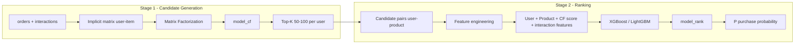

# Kế hoạch: Two-Stage Recommendation (model_cf + model_rank)

## Tổng quan dữ liệu đã rà soát


| File                                                   | Cột chính                                                                                           | Dùng cho                                          |
| ------------------------------------------------------ | --------------------------------------------------------------------------------------------------- | ------------------------------------------------- |
| [datasets/users.csv](datasets/users.csv)               | user_id, gender, city, device_type, traffic_source, created_at                                      | Feature user cho ranking                          |
| [datasets/products.csv](datasets/products.csv)         | product_id, category, sub_category, price, price_range, color, material, style, occasion, is_active | Feature sản phẩm + filter active                  |
| [datasets/orders.csv](datasets/orders.csv)             | user_id, product_id, quantity, price_paid, order_date                                               | Label “mua” (implicit positive) cho CF và ranking |
| [datasets/interactions.csv](datasets/interactions.csv) | user_id, product_id, event_type (view/add_to_cart/search), timestamp                                | Implicit signal cho CF + feature cho ranking      |
| [datasets/email_logs.csv](datasets/email_logs.csv)     | user_id, opened, clicked, clicked_product_id, converted                                             | Feature engagement cho ranking (tuỳ chọn)         |


**Lưu ý:** Hiện datasets chỉ có vài dòng (2 users, 2 products, 1 order). Kế hoạch giả định sau này sẽ mở rộng dữ liệu; code cần xử lý split train/val/test và cold-start khi đủ data.

---

## Kiến trúc pipeline




---

## Stage 1 — Candidate Generation (model_cf)

**Mục tiêu:** Với mỗi user, trả về ~50–100 sản phẩm có khả năng phù hợp (candidates) dựa trên Matrix Factorization.

### 1.1 Chuẩn bị ma trận implicit

- **Nguồn:** `orders` (mua = positive) và `interactions` (view, add_to_cart có thể gán trọng số, ví dụ add_to_cart > view).
- **Ma trận:** `(user_id, product_id) -> strength` (ví dụ: 1.0 cho order, 0.7 add_to_cart, 0.3 view). Có thể chuẩn hoá hoặc scale tùy thử nghiệm.
- **Lưu:** map user_id/product_id sang chỉ số integer (0..n_users-1, 0..n_items-1) để train MF.

### 1.2 Matrix Factorization

- **Thư viện gợi ý:** `implicit` (ALS) hoặc `surprise` (SVD); với implicit feedback nên dùng **implicit (ALS)**.
- **Đầu vào:** ma trận sparse user–item (implicit ratings/strength).
- **Đầu ra:** 
  - Vectors user u_i và item v_j; score (user, item) = u_i \cdot v_j.
  - Hàm `get_candidates(user_id, K=100, filter_already_bought=True)` trả về top-K product_id (có thể lọc sản phẩm đã mua trong quá khứ).

### 1.3 Lưu và load model_cf

- Serialize model (và mapping user_id/product_id <-> index) bằng `pickle` hoặc `joblib` để tái sử dụng.
- File output: ví dụ `models/model_cf.joblib` (hoặc `model_cf.pkl`) và optional `models/model_cf_mappings.pkl`.

---

## Stage 2 — Ranking Model (model_rank)

**Mục tiêu:** Trên tập candidate (user, product) từ Stage 1, dự đoán xác suất mua bằng XGBoost hoặc LightGBM.

### 2.1 Tạo dataset cho ranking

- **Cặp (user, product):**
  - **Positive:** Tất cả (user_id, product_id) có trong `orders` (label = 1).
  - **Negative/Candidate:** Với mỗi user, lấy top-K từ model_cf (ví dụ K=100), loại các cặp đã mua → coi là candidate (label = 0 hoặc dùng soft label sau nếu cần).
- **Cân bằng:** Có thể undersample negative hoặc dùng `scale_pos_weight` (XGBoost/LightGBM) để xử lý mất cân bằng.

### 2.2 Feature engineering

- **User:** gender (encode), city (encode), device_type, traffic_source, is_logged_in, tenure (từ created_at).
- **Product:** category, sub_category, price_range, color, material, style, occasion, is_active, price (log/scale).
- **CF score:** Score từ model_cf cho cặp (user, product) — feature quan trọng.
- **Tương tác:** Số lần view, add_to_cart, search theo (user, product); có thể thêm recency (lần tương tác gần nhất).
- **Tuỳ chọn:** Thống kê từ email_logs (opened, clicked, clicked_product_id) ở cấp user hoặc user-product nếu có.

Encode categorical bằng Label Encoding hoặc One-Hot tùy số lượng category; xử lý missing (unknown, NaN).

### 2.3 Train ranking model

- **Model:** XGBoost hoặc LightGBM (binary classification: P(mua)).
- **Target:** Binary — 1 nếu (user, product) có trong orders, 0 nếu chỉ là candidate chưa mua.
- **Split:** Theo thời gian (order_date) nếu có: train trên quá khứ, val/test trên gần hiện tại; hoặc random split nếu không có thời gian.
- **Lưu:** `models/model_rank.joblib` (hoặc format native của XGB/LGBM).

---

## Cấu trúc thư mục và file code đề xuất

```
K50KHMT-Data-Science/
├── datasets/                    # (đã có)
├── models/                      # Tạo mới: chứa model_cf, model_rank, mappings
├── src/
│   ├── __init__.py
│   ├── data_loader.py           # Load CSV, merge, tạo mapping user/item
│   ├── stage1_candidate.py      # MF training, get_candidates, save/load model_cf
│   ├── stage2_ranking.py        # Feature build, train XGB/LGBM, save/load model_rank
│   └── pipeline.py              # End-to-end: load data -> train CF -> candidates -> train rank -> predict
├── train_pipeline.py            # Script chạy train cả 2 stage
├── predict.py                    # Ví dụ: input user_id -> candidates -> rank -> top-N by P(mua)
└── requirements.txt             # pandas, numpy, scikit-learn, implicit, xgboost hoặc lightgbm, joblib
```

---

## Luồng train và predict

**Train:**

1. Load `users`, `products`, `orders`, `interactions` (và email_logs nếu dùng).
2. Train model_cf trên ma trận implicit (orders + interactions) → lưu `model_cf` + mappings.
3. Sinh candidate set: mỗi user lấy top 50–100 từ model_cf (lọc đã mua nếu cần).
4. Tạo bảng (user_id, product_id, label) và build features → train model_rank → lưu `model_rank`.

**Predict (inference):**

1. Với `user_id`: gọi model_cf → danh sách ~50–100 `product_id`.
2. Với mỗi (user_id, product_id) trong danh sách, build cùng bộ features như lúc train (gồm CF score).
3. model_rank.predict_proba() → xác suất mua → sắp xếp giảm dần → trả về top-N sản phẩm.

---

## Điểm cần lưu ý khi triển khai

- **Cold-start:** User/product mới chưa có trong ma trận MF — có thể fallback: random/popular items hoặc chỉ dùng feature side (user/product) ở ranking.
- **Số lượng data hiện tại:** Dataset rất nhỏ (2 users, 2 products) → MF và ranking sẽ overfit; code nên viết tổng quát, khi bổ sung dữ liệu chỉ cần thay đường dẫn CSV và chạy lại.
- **Reproducibility:** Cố định seed (numpy, sklearn, XGB/LGB) trong train_pipeline.
- **Dependency:** Thêm `implicit` (và compiler C++ nếu build từ source), `xgboost` hoặc `lightgbm`, `pandas`, `numpy`, `scikit-learn`, `joblib` vào `requirements.txt`.

---

## Thứ tự triển khai gợi ý

1. **requirements.txt** — Khai báo thư viện (implicit, xgboost hoặc lightgbm, pandas, numpy, scikit-learn, joblib).
2. **src/data_loader.py** — Đọc CSV, tạo mapping user_id/product_id <-> index, build ma trận implicit và bảng orders/interactions.
3. **src/stage1_candidate.py** — Train MF (ALS), hàm get_candidates(user_id, K), save/load model_cf + mappings.
4. **src/stage2_ranking.py** — Feature engineering từ users/products/orders/interactions + CF score; train XGB/LGBM; save/load model_rank.
5. **src/pipeline.py** — Ghép nối: load data → train CF → sinh candidates → train ranking.
6. **train_pipeline.py** — Script gọi pipeline train, đọc đường dẫn datasets từ config/arg.
7. **predict.py** — Ví dụ inference: user_id → candidates → rank → top-N theo P(mua).

Sau khi bạn đồng ý kế hoạch, có thể bắt đầu triển khai lần lượt từ bước 1.